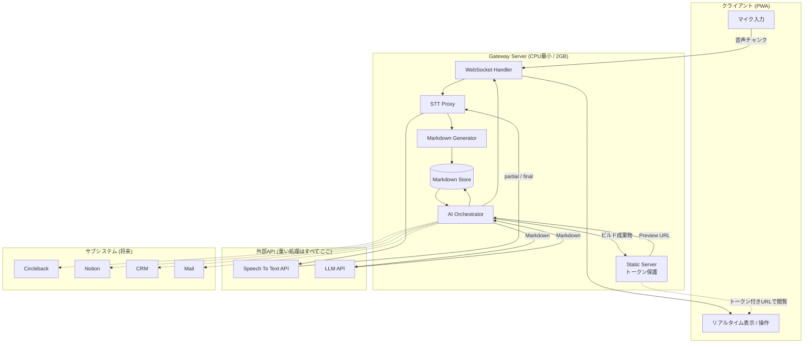
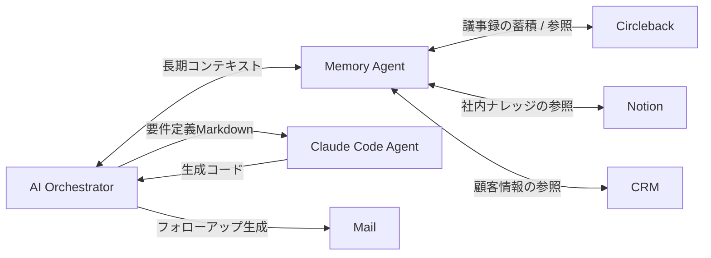

# システム構成

PWA

↓

WebSocket

↓

Gateway Server

↓

Speech To Text API

↓

Markdown Generator

↓

AI Orchestrator

├── Requirement Agent
├── Issue Agent
├── UI Agent
├── Claude Code Agent
└── Review Agent

↓

Deploy

↓

Preview URL

---

## サブシステム

Circleback

Notion

CRM

Mail

これらは全てOrchestrator配下に配置する。

---

## 設計思想

各Agentは互いを知らない。

Markdownだけを受け渡す。

完全疎結合を維持する。

---

# 全体構成図



**この図の要点**

- Gateway Serverは「中継・保存・呼び出し・配信」しか行わない。推論も音声処理もすべて外部APIへ委譲する。
- Markdown Store が唯一の共有状態。エージェント同士は直接通信しない。
- **生成MVPは外部ホスティングへ出さず、Gateway Server自身が静的配信する。** セッショントークンを持つアクセスのみ許可する。
- サブシステム(Circleback / Notion / CRM / Mail)はすべてOrchestratorの配下にぶら下がる。リアルタイム経路には一切割り込まない。

---

# レイヤー構成

| レイヤー | 責務 | 実装単位 |
| --- | --- | --- |
| Client | 音声取得、リアルタイム表示、操作 | PWA |
| Transport | 双方向ストリーミング、再接続 | WebSocket |
| Ingestion | 音声中継、文字起こし結果の受領 | STT Proxy |
| Normalization | 任意の入力をMarkdownへ正規化 | Markdown Generator |
| Persistence | Markdownの読み書き | Markdown Store |
| Orchestration | エージェントの起動順序と条件の判断 | AI Orchestrator |
| Agents | 単一責務の変換処理 | 各Agent (AGENTS.md) |
| Delivery | ビルド・配信・トークン付きURL発行 | Deploy Agent + Static Server |

各レイヤーは1つ下のレイヤーのみに依存する。上位レイヤーを参照してはならない。

---

# 技術選定

| 領域 | 選定 | 理由 / 交換条件 |
| --- | --- | --- |
| クライアント | PWA (TypeScript) | インストール不要で商談先の端末でも即使える。ネイティブアプリは配布コストが高い |
| 音声取得 | MediaRecorder API | ブラウザ標準。追加ライブラリ不要 |
| 音声コーデック | Opus (WebM/Ogg) | モバイル回線で十分な帯域効率。REQUIREMENTS.mdの通信要件を満たす |
| 転送 | WebSocket (バイナリフレーム) | 双方向・低遅延。HTTPポーリングでは遅延要件を満たせない |
| サーバー | Node.js (TypeScript) | I/O中継が主業務でCPUを使わない。クライアントと言語を統一できる |
| 音声認識 | ストリーミングSTT API(プロバイダ非依存) | `SpeechProvider` インターフェース越しに呼ぶ。既定は台本ベースのモック。実装は Deepgram を用意(接続未検証)。Google STT / Whisper系へも差し替え可能 |
| LLM | Claude API(`LLM_MODEL` 既定 `claude-sonnet-5`。Agentごとの既定は `server/src/agents/prompts.ts`。要件定義・コード生成・レビューは `claude-opus-5`) | 長文脈と長時間のエージェント処理に強い。`LLMProvider` 越しに呼び、軽量処理は `claude-sonnet-5` / `claude-haiku-4-5` に振り分ける |
| コード生成 | `CodeProvider` 越しに呼ぶ | 既定は雛形からの組み立て(推論なし・必ず動く)。要件から形を4種類(一覧 / 申請承認 / 点検 / 集計)で選び分ける。LLM実装も用意(接続未検証) |
| 保存 | ファイルシステム上のMarkdown | 初期はローカルで十分。スキーマはDATAFLOW.md |
| 生成アプリのスタック | 素の HTML / CSS / JavaScript(ビルド工程なし) | Gateway Serverが静的配信する。商談中に `npm install` を走らせないため、ブラウザがそのまま解釈できる形に限定する |
| 配信 | Gateway Server自身による静的配信 | `DeployProvider` 越しに呼ぶ。外部ホスティングへは出さない。将来必要になれば実装差し替えのみで対応する |

> **重要:** LLM APIは音声を直接受け付けない。音声 → テキストの変換は必ずSTT APIが担当し、
> LLMはテキスト(Markdown)のみを扱う。この境界を越える設計にしないこと。

---

# 交換可能性(APIは交換可能)

外部依存はすべてインターフェース越しに呼ぶ。実装差し替え時にエージェント側を変更しないこと。

```ts
interface SpeechProvider {
  open(sessionId: string, opts: SpeechOpts): SpeechStream;
}
interface SpeechStream {
  push(chunk: Uint8Array): void;
  on(event: "partial" | "final" | "error" | "close", cb: (e: SpeechEvent) => void): void;
  close(): Promise<void>;
}

interface LLMProvider {
  complete(req: { system: string; input: string; model?: string }): Promise<{
    text: string;
    model: string;
    // 取得できないプロバイダは null。コストの実測に使う
    usage: { inputTokens; outputTokens; cacheReadTokens; cacheWriteTokens } | null;
  }>;
}

interface DeployProvider {
  deploy(req: { sessionId: string; files: FileMap }): Promise<{ url: string; expiresAt: string }>;
}
```

- `SpeechProvider` の実装差し替えは Ingestion レイヤー内で完結する。
- `LLMProvider` の実装差し替えは各Agentに影響しない(Agentはプロンプトとモデル名しか指定しない)。
- `DeployProvider` の実装差し替えは Deploy Agent 内で完結する。既定実装は `LocalStaticDeployProvider`(Gateway Server自身が配信)。外部公開が必要になった時点で別実装を差し込む。

---

# API一覧

## HTTP API

すべて `/api/v1` 配下。認証は `Authorization: Bearer <session token>`。

| メソッド | パス | 用途 | リクエスト | レスポンス |
| --- | --- | --- | --- | --- |
| POST | `/sessions` | セッション開始。WebSocket接続前に呼ぶ | `{ title?, clientInfo? }` | `{ sessionId, wsUrl, token, expiresAt }` |
| GET | `/sessions/{id}` | セッション状態の取得 | - | `{ sessionId, status, startedAt, endedAt, title, artifacts[], audio }` |
| POST | `/sessions/{id}/end` | セッション終了(終了ボタン) | `{ reason }` | `{ sessionId, status, startedAt, endedAt, title, artifacts[], audio }` |
| GET | `/sessions/{id}/documents` | Markdown一覧 | - | `{ documents: [{ name, updatedAt, size }] }` |
| GET | `/sessions/{id}/documents/{name}` | Markdown本文の取得 | - | `text/markdown` |
| PUT | `/sessions/{id}/documents/{name}` | 手入力による上書き / 修正 | `text/markdown` | `{ name, updatedAt }` |
| POST | `/sessions/{id}/generate` | MVP生成を開始。`confirm: true` を必須とする | `{ confirm: true }` | `{ jobId, status, step, ... }` |
| GET | `/sessions/{id}/jobs/{jobId}` | 生成ジョブの進捗 | - | `{ jobId, status, step, error, startedAt, endedAt }` |
| POST | `/sessions/{id}/inputs` | 音声以外の入力を投入(Circleback / Notion / 手入力) | `{ source, payload, target?, speaker? }` | `{ accepted: true, normalizedTo }` |
| GET | `/sessions/{id}/export.zip` | Markdownをまとめて持ち帰る | - | `application/zip` |
| GET | `/healthz` | ヘルスチェック | - | `{ ok: true }` |

`/sessions` 配下はトークンを検証する。トークンが無い・合わない・期限切れは `401`、
セッションが無ければ `404`。**終了済みのセッションでもMarkdownは読み書きできる。**
商談が終わったあとに議事録を読めなければ意味がないため、終了を拒むのはWebSocket(音声の受け口)だけ。

`POST /sessions` だけはトークン無しで叩けるため、回数制限を掛ける
(既定 30回/時間、`SESSION_CREATE_LIMIT`)。超過は `429` + `Retry-After`。

セッションのメタ情報(トークンを含む)は `{DATA_DIR}/session-meta/{sessionId}.json` に
保存し、**サーバーが再起動しても手元のトークンでMarkdownの閲覧・持ち帰りができる。**
実行中に落ちたセッションは起動時に `endReason: "server_restart"` で終了扱いになる
(録音の継続は狙わない。守るのは記録への到達性だけ)。

`PUT /documents/{name}` の失敗:

| 状況 | 状態コード | `error.code` |
| --- | --- | --- |
| 登録簿に無い名前 | `404` | `unknown_document` |
| 追記専用ファイル(`transcript.md`)への上書き | `409` | `append_only` |
| 所有者以外からの書き込み | `409` | `not_owner` |
| 本文が1MBを超える | `413` | `too_large` |

`transcript.md` へ文を足したい場合は `POST /inputs` を使う(DATAFLOW.md の入力アダプタ)。

`POST /generate` の失敗:

| 状況 | 状態コード |
| --- | --- |
| `confirm: true` が無い | `400` |
| 同じセッションで生成ジョブが動いている | `409` |

**明示承認を必須にしている**(RETROSPECTIVE.md「誤トリガーは明示承認で防ぐ」)。
トリガー検出は Sprint 6 だが、承認なしで生成が始まる口は最初から作らない。

## 生成MVPの配信

| メソッド | パス | 用途 |
| --- | --- | --- |
| GET | `/preview/{sessionId}/{buildId}/*` | 生成MVPの静的配信。`?t=<session token>` またはCookieでトークンを検証する |

- トークンが無効・期限切れの場合は `401` を返す。
- `buildId` は生成のたびに変わる。古いビルドは即座に配信対象から外す。
- 閲覧に使うのは**プレビュー用トークン**で、APIとWebSocketで使う操作用トークンとは別の値。
  このURLはQRコードとして画面に映り、開いた端末の履歴にも残るため、
  **1本を撮られただけで商談の全文が読めることがあってはならない。**
- セッション失効と同時に配信を停止する(トークンが通らなくなる)。
  **ファイルの削除は失効と同時ではなく、保持期間(`DOCUMENT_RETENTION_MS`、既定30日)の
  掃除で行う。** Markdownと寿命を揃えるため。ディスク上に残る期間は30日と考えること。

`audio` は受信した音声の統計 `{ chunks, bytes, lastChunkAt }`。疎通確認に使う。

`status` の取りうる値: `active` / `generating` / `ended` / `failed`
`job.status` の取りうる値: `awaiting_approval` / `queued` / `running` / `succeeded` / `failed` / `cancelled`

`awaiting_approval` は**トリガーを検出しただけの状態**で、まだ何も動いていない。
`confirm_generate` が届くまでLLMもコード生成も呼ばない。
`job.step` の取りうる値: `requirements` / `ui` / `code` / `review` / `deploy`

Issue Agent は生成ジョブの段階に含めない。**商談中ずっと回り続けるもの**で、
生成の前後という位置を持たないため(AGENTS.md の実行順序)。

## 外部API呼び出し

| 呼び出し元 | 相手 | 用途 |
| --- | --- | --- |
| STT Proxy | Speech To Text API | 音声ストリームの文字起こし |
| Issue / Requirement / UI / Review Agent | LLM API | Markdown → Markdown の変換 |
| Claude Code Agent | Claude Code | 要件定義 → アプリのソースコード生成 |
| Deploy Agent | (外部呼び出しなし) | 静的ビルドとGateway Server上への配置。既定では外部APIを呼ばない |
| Memory Agent(将来) | Circleback / Notion / CRM | 長期コンテキストの読み書き |

---

# WebSocket仕様

## エンドポイント

```
wss://<host>/ws/v1/sessions/{sessionId}?token=<session token>
```

トークンは `POST /api/v1/sessions` のレスポンスで得たもの。有効期限切れの場合は `4401` でクローズする。

## フレーム種別

| 方向 | 形式 | 内容 |
| --- | --- | --- |
| Client → Server | バイナリ | 音声チャンク(Opus。既定250msごと) |
| Client → Server | テキスト(JSON) | 制御メッセージ |
| Server → Client | テキスト(JSON) | 文字起こし・状態更新・成果物通知 |

## Client → Server(制御メッセージ)

```json
{ "type": "start",  "audio": { "codec": "opus", "sampleRate": 48000, "channels": 1 } }
{ "type": "pause"  }
{ "type": "resume" }
{ "type": "stop",   "reason": "button" }
{ "type": "confirm_generate", "jobId": "job_...", "approved": true }
{ "type": "ping" }
```

| type | 意味 |
| --- | --- |
| `start` | 音声送信の開始を宣言。以降バイナリフレームを送ってよい |
| `pause` | 音声送信の一時停止(機密情報を話す場面での中断) |
| `resume` | 一時停止の解除 |
| `stop` | セッション終了要求 |
| `confirm_generate` | トリガー検出時の確認応答。**明示的な承認が必要**(自動承認はしない) |
| `ping` | 生存確認。30秒ごと |

## Server → Client

```json
{ "type": "session.ready",      "sessionId": "sess_...", "status": "active", "audio": { "chunks": 0, "bytes": 0, "lastChunkAt": null } }
{ "type": "session.stats",      "audio": { "chunks": 120, "bytes": 512000, "lastChunkAt": "..." } }
{ "type": "transcript.partial", "text": "...", "at": "2026-08-01T09:00:00Z" }
{ "type": "transcript.final",   "segment": { "seq": 12, "text": "...", "speaker": "A", "startMs": 0, "endMs": 4000, "at": "..." } }
{ "type": "transcript.backlog", "segments": [ { "seq": 13, "...": "..." } ] }
{ "type": "document.updated",   "name": "issues.md", "updatedAt": "..." }
{ "type": "trigger.detected",   "jobId": "job_...", "phrase": "この内容でアプリ作って" }
{ "type": "job.progress",       "jobId": "job_...", "step": "code", "status": "running" }
{ "type": "artifact.ready",     "kind": "mvp", "buildId": "build_...", "url": "/preview/sess_.../build_.../", "previewToken": "...", "expiresAt": "..." }
{ "type": "session.ended",      "reason": "silence" }
{ "type": "error",              "code": "stt_unavailable", "message": "...", "recoverable": true }
{ "type": "pong" }
```

| type | 意味 |
| --- | --- |
| `session.ready` | 接続確立時に1度だけ送る。再接続時も送る。`audio` には累積の受信統計が入る |
| `session.stats` | 音声受信の統計。既定5秒間隔。疎通確認とUI表示に使う |
| `session.ended` | セッションが終了した |
| `error` | 処理できないメッセージを受け取った。`recoverable: true` なら接続は維持される |
| `pong` | `ping` への応答 |

**受信側は未知の `type` を無視すること。** メッセージはSprintごとに増える。
`transcript.*` は Sprint 3、`document.updated` と `job.progress` は Sprint 5、
`trigger.detected` / `artifact.ready` は Sprint 6 で追加する。

`document.updated` は**更新の通知だけで、本文は載せない。**
クライアントは `GET /sessions/{id}/documents/{name}` で取り直す。
本文をWebSocketで流すと、切断中の更新を取りこぼしたときに追いつく手段が無くなる。

## 再接続

- 切断時、クライアントは指数バックオフ(1s / 2s / 4s / 8s、上限30s)で再接続する。
- 再接続時は同じ `sessionId` と `token` を使う。サーバーはセッションを継続し、切断中に確定した文字起こしを **`transcript.backlog`** としてまとめて再送する。
- 切断中の音声はクライアント側で最大60秒バッファし、再接続後に送信する。それを超える分は破棄する。

## クローズコード

| コード | 意味 | クライアントの挙動 |
| --- | --- | --- |
| 1000 | 正常終了 | 再接続しない |
| 4401 | トークン不正・期限切れ | セッション再作成 |
| 4404 | セッションが存在しない | セッション再作成 |
| 4409 | セッションは既に終了済み | 再接続しない |
| 4429 | レート制限 | バックオフ後に再接続 |
| 1011 | サーバー内部エラー | バックオフ後に再接続 |

---

# サブシステム接続関係



## Circleback

- **役割**: 長期コンテキスト管理、議事録の蓄積、ナレッジ化。
- **接続点**: Memory Agent 経由。リアルタイム経路には接続しない。
- **方向**: セッション終了後に `summary.md` / `todo.md` を書き出す(push)。次回商談前に過去議事録を読み込む(pull)。
- **理由**: リアルタイム処理と分離することで、Circlebackの障害や遅延が商談中の体験に影響しない。

## Notion

- **役割**: 社内ナレッジ・過去事例・業種別テンプレートの参照元。
- **接続点**: Memory Agent 経由。取得した内容はMarkdownへ正規化してから `context.md` に格納する。
- **方向**: 主に読み取り。将来的に成果物の書き戻しを行う。

## Claude Code

- **役割**: 要件定義Markdown → 動作するWebアプリのソースコード生成。
- **接続点**: Claude Code Agent 経由。Orchestratorから見れば「Markdownを渡すとファイル群が返るエージェント」でしかない。
- **入力**: `requirements.md` + `ui.md`
- **出力**: ファイル群(`FileMap`)。ビルド失敗時はReview Agentの指摘を添えて最大3回まで再試行する。

## CRM / Mail

- **役割**: 商談後のフォローアップ。PROJECT.mdの将来構想に該当する。
- **接続点**: Orchestrator配下のサブシステム。Phase1〜6のスコープ外。

---

# 障害時の縮退動作

| 障害 | 縮退動作 |
| --- | --- |
| STT APIが落ちた | 文字起こしを停止し、`error` を通知。音声はバッファせず破棄。手入力への切り替えを案内する |
| LLM APIが落ちた | 文字起こしは継続する。課題抽出・要件定義のみ停止し、復旧後に未処理分をまとめて処理する |
| ビルド・配信が失敗した | 生成コードをZIPでダウンロード可能にし、URLの代わりに提示する |
| WebSocketが切断された | クライアント側で最大60秒バッファし、再接続後に送信する |
| 生成MVPのビルドが3回失敗 | 要件定義とUI設計のMarkdownまでを成果物として提示し、生成失敗を明示する |

**原則**: リアルタイム文字起こしは他のどの機能よりも優先して生存させる。
文字起こしさえ動いていれば商談は成立する。

---

# デプロイ構成

| 環境 | 用途 | 備考 |
| --- | --- | --- |
| local | 開発 | STT / LLM / Deploy はすべてモック実装で動かせること |
| staging | 社内デモ検証 | 本物の外部APIに接続 |
| production | 商談での実利用 | 生成MVPはセッション失効と同時に配信停止(ファイル削除は保持期間後) |

生成MVPは外部ホスティングを使わないため、環境ごとにデプロイ先を切り替える必要はない。
Gateway Serverのプロセスと同じ場所で配信する。

シークレット(APIキー、デプロイトークン)は環境変数のみで管理する。
リポジトリにも、生成されたMVPのコードにも含めないこと。
