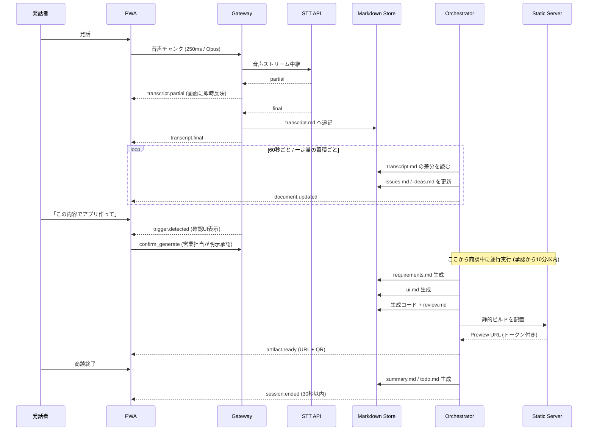

# データフロー

音声

↓

音声ストリーミング

↓

文字起こし

↓

Markdown

↓

課題抽出

↓

要件定義

↓

画面設計

↓

MVP生成

↓

Deploy

↓

URL

---

## 保存先

Realtime Cache

↓

Markdown

↓

Notion（将来）

↓

Circleback（将来）

---

# 詳細フロー



---

# 保存レイヤー

| レイヤー | 保持内容 | 保持期間 | 目的 |
| --- | --- | --- | --- |
| Realtime Cache | 直近の未確定テキスト、差分処理のカーソル位置 | セッション中のみ(メモリ) | 低遅延の反映と差分投入 |
| Markdown Store | 全Markdownドキュメント | セッション終了後30日 | 唯一の正本。全Agentの入出力 |
| Gateway上の配信ディレクトリ | 生成コード、静的ビルド成果物 | セッション有効期間中 | デモアプリの配信(トークン保護。外部公開しない) |
| Notion(将来) | ナレッジ化した要件・事例 | 無期限 | 社内資産としての蓄積 |
| Circleback(将来) | 議事録・長期コンテキスト | 無期限 | 次回商談での参照 |

**音声データは保存しない。** Gateway上を通過するのみで、ディスクにもオブジェクトストレージにも書き込まない。

---

# Markdownスキーマ

セッションごとに以下のディレクトリを持つ。ファイル名は固定。

```
sessions/{sessionId}/
├── meeting.md              # Meeting     : 商談のメタ情報
├── transcript.md           # Realtime Transcript : 確定した文字起こし
├── issues.md               # Issues      : 抽出された課題
├── ideas.md                # Ideas       : 解決アイデア
├── requirements.md         # Requirements: 要件定義
├── ui.md                   # (画面設計。requirements.md の従属)
├── todo.md                 # Todo        : 商談後のアクション(終了時に生成)
├── ai_instruction.md       # AI Instruction : コード生成への指示
├── review.md               # (レビュー結果。生成物の従属)
├── summary.md              # Summary     : 最終まとめ
└── context.md              # (Notion / Circleback から取り込んだ参考情報)
```

## meeting.md

```markdown
# Meeting

- session_id: sess_01H...
- started_at: 2026-08-01T09:00:00+09:00
- ended_at:
- title: 株式会社◯◯ 業務改善ヒアリング
- participants:
  - 自社: 田中
  - 顧客: 佐藤様、鈴木様
- status: active
```

## transcript.md

確定したテキストのみを追記する。partialは書き込まない。

```markdown
# Realtime Transcript

## 09:00:12 | A
在庫の管理を今もExcelでやっていて、担当者しか触れない状態です。

## 09:00:35 | B
更新はどのくらいの頻度ですか。

## 09:00:41 | A
毎朝1回です。ただ実態とズレることが多くて。
```

- 見出しは `## HH:MM:SS | 話者ラベル`。話者分離が使えない場合は `## HH:MM:SS` のみ。
- **追記専用。** 既存行を書き換えてはならない(差分処理のカーソルが壊れるため)。

## issues.md

```markdown
# Issues

## ISS-001 在庫データが属人化している
- 根拠: 09:00:12 「担当者しか触れない状態です」
- 影響: 担当者不在時に在庫確認が停止する
- 深刻度: high
- 状態: open
```

- `深刻度`: `high` / `medium` / `low`
- `状態`: `open` / `merged` / `dropped`
- 同じ課題が再度言及された場合は新規追加せず、既存項目の根拠に追記する。

## ideas.md

```markdown
# Ideas

## IDEA-001 在庫の共有ダッシュボード
- 対応課題: ISS-001
- 概要: 誰でも閲覧できる在庫一覧画面を用意し、更新履歴を残す
- 実現難易度: low
```

## requirements.md

Claude Code Agentへの主入力。ここが曖昧だと生成物の品質が落ちる。

```markdown
# Requirements

## 目的
在庫状況を担当者以外も確認できるようにする。

## 対象ユーザー
- 現場担当者(閲覧)
- 在庫管理者(登録・更新)

## 機能要件
- FR-1 在庫一覧を表形式で表示する
- FR-2 品目名で絞り込める
- FR-3 在庫数を更新でき、更新者と時刻が記録される

## データモデル
- Item: id, name, quantity, unit, updated_at, updated_by

## 画面
- 一覧画面
- 更新モーダル

## 対象外
- 発注機能
- 権限管理
```

## ui.md

```markdown
# UI

## 画面1: 在庫一覧
- ヘッダー: タイトル + 検索ボックス
- 本体: テーブル(品目 / 在庫数 / 単位 / 最終更新)
- 行クリックで更新モーダルを開く

## 画面2: 更新モーダル
- 在庫数の入力欄
- 保存 / キャンセル
```

## todo.md

```markdown
# Todo

- [ ] 現行のExcelファイルを共有いただく — 担当: 佐藤様 — 期限: 08/08
- [ ] 想定ユーザー数の確認 — 担当: 田中 — 期限: 08/05
```

## ai_instruction.md

```markdown
# AI Instruction

- スタック: 素の HTML / CSS / JavaScript(ES2022)。**ビルド工程を持たせない**
- 永続化: なし(インメモリのモックデータ)
- スタイル: 最小限。装飾よりも動作を優先
- 画面数: 2以内
- 認証: なし
- 制約: 外部を一切参照しないこと(CDN・Webフォント・外部API)。オフラインで動くこと
- 制約: サーバーサイド実行を使わないこと(`process.env` / `require()` / SSR)
- 制約: APIキーや認証情報を書かないこと
- エントリ: `index.html`
```

**ビルド工程を持たせないのは、商談中の時間を守るため。** `npm install` を走らせると、
回線とサーバー(メモリ2GB)次第で「承認から10分以内」の予算を使い切る。
ブラウザがそのまま解釈できる形なら、生成から配信までが数秒で終わる。

このファイルの所有者は Orchestrator。生成の直前に既定値で作られるが、
**手で書き換えれば尊重される**(既にあれば上書きしない)。

## review.md

```markdown
# Review

## 判定: needs_fix

- [BLOCK] 在庫数に負の値を入力できる (FR-3 違反)
- [WARN] 検索が大文字小文字を区別している
```

- `判定`: `pass` / `needs_fix`
- `[BLOCK]` が1件でもあれば Claude Code Agent へ差し戻す(最大3回)。

## summary.md

議事録専用ファイル(`minutes.md`)は作らない。**議事録としての内容もここに統合する。**

```markdown
# Summary

## 商談概要
在庫管理の属人化についてヒアリング。

## 会話の要点
- 在庫管理は現在Excel運用で、更新は毎朝1回
- 担当者以外がファイルを触れない状態
- 実在庫との乖離が頻発している

## 抽出した課題
- ISS-001 在庫データが属人化している

## 提案した解決策
- 在庫共有ダッシュボード

## 生成したMVP
- URL: https://...
- 有効期限: 2026-08-08

## 次のアクション
- todo.md を参照
```

## context.md

Notion / Circleback から取り込んだ参考情報。**読み取り専用**として扱い、Agentはここへ書き込まない。

---

# 差分処理の規約

全文を毎回LLMへ投入するとコストと遅延が線形に増える。以下の規約で差分のみを処理する。

1. Orchestrator はセッションごとに `transcript.md` の**処理済みバイト位置**を Realtime Cache に保持する。
2. 分析実行時は、未処理範囲のテキスト + 既存の `issues.md` / `ideas.md` の全文を入力とする。
3. 出力は「新規追加分」と「既存項目への追記」に分けて返させ、Orchestratorがマージする。
4. マージ後、処理済み位置を進める。
5. LLM呼び出しでは、システムプロンプトと `context.md` を安定した前置きとして配置し、プロンプトキャッシュを効かせる。変動する差分テキストは必ず末尾に置く。

`requirements.md` 以降の生成は差分ではなく、その時点の `issues.md` / `ideas.md` の**全文**を入力として一括生成する。

---

# 冪等性と競合

- 各Markdownファイルは**単一のAgentのみが書き込む**(AGENTS.md の所有者表を参照)。複数Agentが同じファイルへ書くことを禁じる。
- 追記専用ファイル(`transcript.md`)と、全文置換ファイル(`requirements.md` 等)を区別する。全文置換時は一時ファイルへ書いてからアトミックにリネームする。
- 同一セッションに対する生成ジョブは同時に1つまで。実行中の `POST /generate` は `409 Conflict` を返す。
- 再接続時は処理済み位置から再開するため、同じ範囲を二重に分析しない。

---

# 入力アダプタ(入力は自由 / 出力はMarkdown)

音声以外の入力も、必ずこの層でMarkdownへ正規化してから後段へ渡す。後段は入力元を一切意識しない。

| 入力元 | 変換先 | 経路 | 備考 |
| --- | --- | --- | --- |
| PWA音声 | `transcript.md` | WebSocket | Phase1〜2のメイン経路 |
| 手入力(会話の補足) | `transcript.md` | `POST /inputs` | 話者ラベルは「手入力」 |
| 手入力(生成物の修正) | 全文置換ファイル | `PUT /documents/{name}` | `requirements.md` などを直接直す |
| Circleback(将来) | `transcript.md` / `context.md` | `POST /inputs` | 既存議事録の取り込み |
| Notion(将来) | `context.md` | `POST /inputs` | 社内ナレッジの参照 |

**手入力の経路が2つあるのは、追記専用ファイルと全文置換ファイルで扱いが違うため。**
`transcript.md` は追記専用なので `PUT` では触れない(`409` を返す)。会話への補足は
`POST /inputs` から1発話として追記する。`requirements.md` のような全文置換ファイルは
`PUT` でそのまま上書きしてよい。

`transcript.md` の並び順は**到着順**であり、見出しの時刻順とは限らない。
手入力は入力した時刻で追記されるため、直前の発話より古い時刻になることがある。
差分処理はカーソル(バイト位置)で進むため、並び順に依存してはならない。

新しい入力元を追加する際に変更してよいのはこのアダプタ層のみ。
Orchestrator以降を変更する必要が生じた場合、それは設計が壊れている合図である。

入力アダプタはAgentではない。AGENTS.md の所有者表は「どのAgentが書くか」を定めるもので、
外部入力の正規化はその手前にある。そのためアダプタは所有者以外のファイルへも書けるが、
追記専用/全文置換の区別だけは他と同じく守る。
